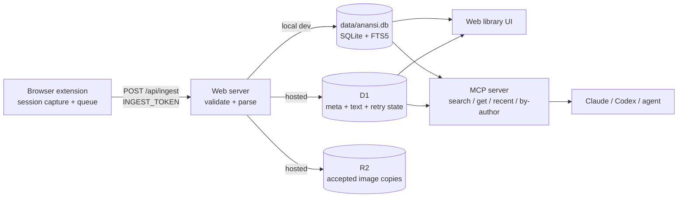

<div align="center">

# 🕸️ Anansi

**Your personal web memory, all in one place.**

Anansi captures the things you save online — bookmarks, saved posts, GitHub stars, web pages — into one searchable library your coding agent can query over MCP. Your browser supplies the platform session; your Cloudflare account (or a local SQLite file for dev) stores the capture.

[](./LICENSE)
[](https://modelcontextprotocol.io)
[](https://github.com/jojomensah89/anansi)
[](https://github.com/jojomensah89/anansi)
<!-- PUBLIC LAUNCH: uncomment after repo goes public -->
<!-- [](https://github.com/jojomensah89/anansi) -->
<!-- [](https://github.com/jojomensah89/anansi/issues) -->
<!-- [](https://github.com/jojomensah89/anansi/commits) -->
<!-- [](https://github.com/jojomensah89/anansi/actions/workflows/ci.yml) -->

[Get Started](#-quickstart) · [Supported Sources](#-supported-sources) · [Ask it from your agent](#-ask-it-from-your-agent-mcp) · [Report a bug](https://github.com/jojomensah89/anansi/issues/new?template=bug_report.yml)

<!-- TODO: add hero visual — docs/assets/demo.gif + library screenshot -->

</div>

## ✨ Why Anansi?

Bookmarks rot across X, Reddit, GitHub, and 200 open tabs. Pocket-style tools own your data, and agents can't read them.

Anansi fixes that:

- 📥 **Capture where you browse** — extension uses your existing signed-in session, no scraping service
- 💸 **~$0 hosting in your account** — one Worker, one D1, one R2. No server to babysit, no account controlled by anyone else, no paid Queues or Durable Objects by design
- 🔍 **One searchable library** — full text, authors, recency, source filters
- 🏷️ **Organize your way** — manual tags (bulk included), saved views, highlights, private notes, favorites
- 🧠 **Agent-native** — Streamable HTTP MCP server with 8 read-focused tools
- 🔒 **Conservative by design** — bearer-auth ingest, no `<all_urls>`, no `cookies` permission, no GitHub OAuth/PAT
- 🔁 **Durable** — queued capture with retry + resume cursors, survives restarts and rate limits

## 📥 Supported Sources

| Source | Capture | Status |
| --- | --- | --- |
|  X bookmarks | History import + live saves | Supported |
|  Reddit saves | History import + live saves | Supported |
|  GitHub stars | Full import + live star/unstar events | Supported |
|  Web pages & bookmarks | Save pages, selections, and Chrome bookmarks | Supported |
|  Chrome bookmarks (web submode) | Optional mirroring into Web pages & bookmarks | Supported |
|  TikTok favorites | — | Paused for repair; existing rows retained but hidden |

> GitHub capture is extension-only. It reads the signed-in GitHub stars pages in your browser, includes repositories visible to that account — including visible private repositories — and needs no GitHub OAuth or personal access token.

Live saves are delivered immediately. Anansi also performs one daily incremental catch-up for sources that support history import, covering changes made while Chrome or the extension was inactive. GitHub and Reddit import via background session requests without opening tabs. Anansi closes only tabs it created. If a provider session is missing, the popup asks you to sign in — use the explicit **Sign in** button, then retry. Network and rate-limit failures keep the resume cursor. TikTok capture is paused in the shipped extension and web UI while its authenticated path is repaired; old rows are retained for a deliberate future re-enable.

## 🚀 Quickstart

Two paths, same library: run it locally or host it in your own Cloudflare account.

### A. Local

Requirements: [Bun](https://bun.sh/) 1.3+, Chromium-based browser. SQLite DB is created automatically.

```bash
bun install
cp .env.example .env
# Edit .env and set three independent server secrets:
#   LIBRARY_TOKEN, INGEST_TOKEN, MCP_TOKEN
# Then mirror INGEST_TOKEN into ANANSI_EXTENSION_INGEST_TOKEN.
# Keep ANANSI_EXTENSION_ORIGIN=http://127.0.0.1:3001
bun run dev:local
```

Open `http://127.0.0.1:3001`. This is the one public local origin: the library is at `/`, JSON endpoints are under `/api`, and MCP is at `/mcp`. The launcher creates `data/anansi.db` on first start and prints the local library sign-in token.

An internal Bun process listens on port `8788` because Vite's Node runtime cannot load Bun's SQLite implementation. Vite proxies `/api` and `/mcp` to it. Do not enter or configure port `8788` anywhere.

Build the private extension in a second terminal:

```bash
bun run --cwd apps/extension build
```

Open `chrome://extensions` → enable **Developer mode** → **Load unpacked** → choose `apps/extension/.output/chrome-mv3`. The extension connects immediately; there is no server or token field in the popup.

> The configured build contains your ingest credential. This is appropriate for your private, load-unpacked extension, but anyone with the artifact can extract it. Never upload this configured build to a public extension store or share it.

GitHub first import: sign in to GitHub in the same browser profile → popup → **Import** beside GitHub. It walks your stars pages in the worker (no tabs open), persists the pagination cursor, and resumes after interruptions. Unstarring hides from current-star view without deleting history; re-starring restores it.

### Developer-only local AI search and tagging

The hosted path uses the existing Cloudflare Workers AI and Vectorize bindings;
hosted users only enable Semantic search in Settings. A local model is not
required for installation, `bun run dev:local`, or deployment.

For the local web UI, install [Ollama](https://ollama.com/download) (0.11.10+
for EmbeddingGemma). A clone-to-working semantic setup is:

1. Confirm the tools are available:

   ```powershell
   bun --version       # 1.3+
   ollama --version    # 0.11.10+ for EmbeddingGemma
   ollama list
   ```

2. Install Anansi's dependencies and create the local environment if you have
   not already done so:

   ```powershell
   bun install
   Copy-Item .env.example .env
   ```

   Keep the existing local authentication values in `.env`; Ollama settings
   are server-side values and must not be renamed to `VITE_*` variables.

3. Pull the embedding model once:

   ```powershell
   ollama pull embeddinggemma
   ```

4. Make sure the Ollama daemon is running. The Ollama desktop app normally
   does this; if it is not running, start it with `ollama serve` in another
   terminal.

5. Start Anansi:

   ```powershell
   bun run dev:local
   ```

   Open `http://127.0.0.1:3001`, go to **Settings**, and enable **AI semantic
   search** or **Automatic tags**. Semantic search uses `embeddinggemma`; tags
   use the configured `OLLAMA_TAG_MODEL` (default
   `qwen3:4b-instruct-2507-q4_K_M`).

6. Build and load the extension so you can import real bookmarks:

   ```powershell
   bun run --cwd apps/extension build
   ```

   In `chrome://extensions`, enable **Developer mode**, choose **Load unpacked**,
   and select `apps/extension/.output/chrome-mv3`. Sign in to a supported source
   and import a few bookmarks. Then search using a concept rather than an exact
   keyword. Anansi calls Ollama on `http://127.0.0.1:11434` from the local server
   and stores vectors in the ignored SQLite sidecar at
   `data/semantic/ollama.sqlite`. New bookmarks are saved and keyword-searchable
   immediately; semantic indexing catches up in the background. If Ollama is
   stopped or the model is missing, the UI says so and continues with BM25
   keyword results. Tagging also runs in the background and never blocks a save.

   The extension is optional if the clone already contains library data or you
   only want to run the synthetic smoke test; it is required to capture new
   browser bookmarks.

Local keyword search remains available without Ollama. It uses SQLite FTS5 with
BM25 ranking: terms are quoted and implicitly ANDed, English stemming is
enabled, a trailing `*` performs prefix matching, quoted text is a phrase, and
misspellings are not fuzzy-matched. Semantic search adds an optional vector
candidate set and keeps the keyword page when the local index is warming or
unavailable.

Before using private bookmarks, validate the complete local path with synthetic
data:

```powershell
bun run semantic:ollama
bun run ai:tagging:ollama
bun run e2e:local
```

The check should report an observed dimension (768 for the default model) and
`"expectedSemanticOnlyMatch": true`. This proves the local provider, sidecar,
hybrid ranking, and filtering path; it does not prove a hosted Cloudflare
deployment or MCP/CLI semantic search. `bun run e2e:local` is the stronger
opt-in local acceptance: it uses a temporary SQLite database to exercise
authenticated ingest/idempotency, Ollama tagging and embeddings, FTS5, the
semantic API, extension configuration, and HTTP plus stdio MCP. These commands
never use private captures or Cloudflare credentials.

Change `OLLAMA_EMBEDDING_MODEL` in `.env` to try `nomic-embed-text` (smaller,
English-focused) or `nomic-embed-text-v2-moe` (larger, multilingual) instead;
run `ollama pull <model>` before restarting, and changing models creates a
fresh local index generation. The
existing `bun run semantic:local` Transformers.js smoke remains available for
offline contract testing only. The remote Workers AI/Vectorize check is
separate and documented in
`docs/superpowers/plans/2026-09-07-alchemy-semantic-smoke-runbook.md`.

To force a rebuild, stop the local server and remove only the sidecar (the
canonical library database is separate), then start Anansi again:

```powershell
Remove-Item -LiteralPath .\data\semantic\ollama.sqlite
bun run dev:local
```

Common fixes:

- **“Ollama is unavailable”** — run `ollama list`, start `ollama serve`, and
  retry the search. BM25 remains available while Ollama is down.
- **Model not found** — run `ollama pull embeddinggemma`, or make
  `OLLAMA_EMBEDDING_MODEL` match a model shown by `ollama list`.
- **Automatic tags** — run `ollama pull qwen3:4b-instruct-2507-q4_K_M`, or make
  `OLLAMA_TAG_MODEL` match a text-generation model shown by `ollama list`.
- **Index warming** — leave the local server running; jobs are processed in the
  background. A model change or sidecar removal intentionally starts a fresh
  generation.
- **Remote Ollama URL** — this is an explicit developer override; Anansi prints
  a warning because bookmark text will leave the machine. The default is
  loopback.

### B. Cloudflare — your account, ~$0 (intended deployment path)

> ⚠️ The hosted path is wired in the repository, but a clean-account Cloudflare deployment has not been verified in this checkout. Treat the procedure below as the intended path until that external acceptance gate is completed.

The stack is managed by Alchemy (`packages/infra/alchemy.run.ts`): one Anansi Worker, one D1, one R2 bucket, one Workers AI binding, and one Vectorize index per Alchemy stage. D1 holds searchable metadata and text. Migrations live in `packages/db/drizzle`; never use `db:push` because the FTS5 virtual table and triggers require the migration path. R2 holds accepted image copies, and retry state lives in D1 in small batches via request `waitUntil` plus scheduled recovery, so there is nothing paid to provision. Both AI features start off; enable Semantic search or Automatic tags from `/settings` when you want to spend your own Cloudflare quota. Three separate secrets gate the three doors: `LIBRARY_TOKEN` (web UI session), `INGEST_TOKEN` (extension), and `MCP_TOKEN` (agents). Absent means closed, never open.

#### First deploy versus later deploys

`bun run deploy` is safe to run repeatedly. It is a desired-state update, not a command that creates a new Anansi Worker every time:

- **First deploy for a stage:** Alchemy creates the stage's D1, R2, Vectorize index, and Anansi Worker, then applies the complete migration history.
- **Later deploy with no changes:** Alchemy plans no-ops and does not create another Worker or database.
- **Later deploy after code changes:** Alchemy updates the existing Anansi Worker in that same stage.
- **Later deploy after a migration is added:** Alchemy updates the D1 resource, applies only migrations that are not already recorded, and then reconciles the Worker if its bundle or bindings changed.

This stack also uses `Cloudflare.state()`. On the first Alchemy run in a Cloudflare account, Alchemy may create its separate state-store Worker and supporting state resources. That state store is reused by later deploys and by other stacks and stages using the same account; it is not recreated for every `bun run deploy`.

Stages are isolated. Keep using the same stage when you intend to update the same installation. Alchemy defaults to a per-user development stage such as `dev_<user>`; use an explicit stable stage for a long-lived installation, for example:

```powershell
# Default stage, from the repository root
bun run deploy

# Stable long-lived stage, from the repository root
$env:STAGE = "prod"
bun run deploy

# The equivalent direct infra command
bun run --cwd packages/infra deploy -- --stage prod
```

Changing the stage creates or updates a different isolated installation. Changing the logical resource IDs in `packages/infra/alchemy.run.ts`, destroying the stage, or deploying with a different Cloudflare account can also point the command at different infrastructure.

#### Schema migrations after the first deploy

The TypeScript schema and the SQL migration history are separate responsibilities. A change to `packages/db/src/schema.ts` does not change remote D1 by itself.

When adding a table or changing the schema:

1. Change `packages/db/src/schema.ts`.
2. Run `bun run db:generate` and review the new numbered SQL file in `packages/db/drizzle`.
3. Test the migration locally with `bun run dev:local` or the focused database tests.
4. Commit the schema change, the generated SQL, and the generated Drizzle metadata.
5. Pull the commit into the deployed clone and run `bun run deploy`.

The deploy command first copies the canonical SQL files into the ignored Alchemy staging directory, then Alchemy compares them with the migration history in that D1 database. Already-applied migrations are skipped; new files are applied in numeric order. A fresh installation runs the complete history. Do not edit or delete an already-applied migration. Add a new migration instead. For renames, drops, or data transformations, use an expand/backfill/contract sequence so the running Worker remains compatible during the rollout.

If only the application code changed, run `bun run deploy` to publish that Worker change. If neither the code nor infrastructure changed, there is normally no reason to deploy again. A `git pull` changes local files only; it does not update the Cloudflare installation until a deploy is run.

These semantics are documented by [Alchemy's deploy command](https://alchemy.run/cli/deploy/), [Alchemy stages](https://alchemy.run/environments/stages/), and [Alchemy's Cloudflare D1 migration resource](https://alchemy.run/providers/cloudflare/d1/database/).

Cloudflare credentials for deploy (unverified — least-privilege list to be confirmed on first successful deploy):

```bash
# Interactive login (recommended locally — no manual token):
bunx alchemy login --configure   # run from packages/infra

# CI / headless instead needs:
# CLOUDFLARE_API_TOKEN + CLOUDFLARE_ACCOUNT_ID in the environment.
# The stack implies Workers Scripts, D1, and R2 scopes plus the
# alchemy state-store worker. Create the token at
# dash.cloudflare.com → Profile → API Tokens; prefer a scoped token
# over a superuser token.
```

Server secrets (same `.env` keys as local):

Generate three independent secrets. On Windows PowerShell:

```powershell
$library = (openssl rand -hex 32).Trim()
$ingest = (openssl rand -hex 32).Trim()
$mcp = (openssl rand -hex 32).Trim()
"LIBRARY_TOKEN=$library"
"INGEST_TOKEN=$ingest"
"MCP_TOKEN=$mcp"
```

On macOS/Linux, run `openssl rand -hex 32` three times. Paste the three
outputs into `.env`:

```bash
cp .env.example .env
# LIBRARY_TOKEN=<first output>
# INGEST_TOKEN=<second output>
# MCP_TOKEN=<third output>
# Never put them in VITE_* vars or commit them.
bun run deploy   # turbo → @anansi/infra → alchemy deploy
```

Run the command again after pulling a later Anansi release when you want that
release's Worker code, bindings, or database migrations in this stage. It does
not create a second Worker: Alchemy plans an update or no-op against the
existing stage. Do not run `bun run db:migrate:deploy` for the remote D1; that
Drizzle command targets the local SQLite database configured for development.

After deployment returns `https://<worker>.workers.dev`:

1. Set `ANANSI_EXTENSION_ORIGIN=https://<worker>.workers.dev` in your local `.env`.
2. Set `ANANSI_EXTENSION_INGEST_TOKEN` to the same value deployed as `INGEST_TOKEN`.
3. Run `bun run --cwd apps/extension build`.
4. Load `apps/extension/.output/chrome-mv3` from `chrome://extensions`.
5. Open the popup and confirm all sources appear and the library is connected.
6. Use **Open library**, sign in with `LIBRARY_TOKEN`, and verify one page capture.
7. Sign into each provider in the same Chrome profile before its first import.

The Worker is the only public origin: the library is `/`, the API is `/api/*`, and MCP is `/mcp`. There are no deployed ports to configure.

## 🧠 Ask it from your agent (MCP)

Streamable HTTP MCP server at `http://127.0.0.1:3001/mcp` locally (or `https://<worker>.workers.dev/mcp` when hosted). Bearer auth with `MCP_TOKEN` when configured. The web `/mcp` setup page uses a literal `<YOUR_MCP_TOKEN>` placeholder and never prints the secret.

| Tool | Purpose |
| --- | --- |
| `search_saved` | Search saved items, ranked excerpts + source URLs |
| `get_saved` | One item with text, links, media, thread context |
| `get_saved_many` | A bounded shortlist of items in requested order |
| `list_saved` | Browse saved items with filters and a cursor |
| `list_recent_saves` | Newest saved items |
| `list_author_saves` | Items from one author |
| `list_tags` | Visible tag vocabulary and usage counts |
| `library_stats` | Visible library and media statistics |

The optional `source` filter accepts visible `x`, `reddit`, `github`, and `web`
items. TikTok rows remain hidden while that source is paused. MCP search is
keyword/BM25 today; it does not claim the web UI's optional semantic ranking.

Claude Code:

```bash
claude mcp add --transport http anansi http://127.0.0.1:3001/mcp --header "Authorization: Bearer <YOUR_MCP_TOKEN>"
```

Codex / env-backed clients:

```toml
[mcp_servers.anansi]
url = "http://127.0.0.1:3001/mcp"
bearer_token_env_var = "MCP_TOKEN"
```

Keep `MCP_TOKEN` in the client environment, never in a committed file.

### Choose a transport

Anansi exposes the same MCP server through two transports. The tool definitions
and database functions are shared; only the connection method changes.

| Use case | Configuration | Transport and database | Authentication |
| --- | --- | --- | --- |
| OpenCode or another local agent | `opencode.json` | Starts `bun run apps/cli/src/cli.ts serve --mcp` and reads the local SQLite library directly | The local process boundary; no HTTP token |
| Browser-based or remote-capable clients | MCP URL above | Streamable HTTP at `/mcp`; local Vite proxies `3001` to the internal Bun server on `8788` | `Authorization: Bearer <MCP_TOKEN>` |

The OpenCode entry is deliberately `type: "local"`:

```json
{
  "mcp": {
    "anansi": {
      "type": "local",
      "command": ["bun", "run", "apps/cli/src/cli.ts", "serve", "--mcp"],
      "enabled": true
    }
  }
}
```

This is not a second MCP implementation. The CLI connects the shared server
to an stdio transport, while `/mcp` connects that same server to the
Web-standard Streamable HTTP transport. The CLI writes diagnostics to stderr;
stdout remains reserved for JSON-RPC.

### Verify the MCP paths

For a repeatable local acceptance check, run:

```bash
bun run scripts/e2e-local-smoke.ts
```

This requires a running Ollama daemon with the configured embedding and tag
models. It uses a temporary SQLite library and exercises authenticated local
ingest, `initialize`, `tools/list`, search, and both HTTP and stdio MCP. If the
AI jobs remain pending, the harness stops before its MCP assertions; treat
that as an Ollama/model-readiness failure rather than an MCP transport result.
For the OpenCode wiring itself, run:

```bash
opencode mcp list
```

The Anansi entry should report `connected`. This verifies that OpenCode can
launch the configured stdio process; it does not test the HTTP route.

With `bun run dev:local` running, the HTTP route can be checked at both layers:

```text
http://127.0.0.1:8788/mcp   internal Bun handler
http://127.0.0.1:3001/mcp   public local origin and Vite proxy
```

The authenticated HTTP check should reject a wrong bearer with `401`, accept
`initialize` with `200`, list the same eight tools, complete a search and
`get_saved` call, and return a normal MCP error/result for hostile search text.
These local checks prove the local handler, proxy, auth, and transport wiring;
they do not prove a deployed Cloudflare Worker or an external client reaching
it over the internet.

The standalone scripts under `apps/cli/scripts/mcp-smoke.ts` and
`apps/web/scripts/mcp-http-smoke.ts` also exercise real transports. Their
search assertions depend on the hard-coded sample query being present in the
current library, so a zero-result failure can be a stale data fixture rather
than a transport failure. Use `scripts/e2e-local-smoke.ts` for an isolated,
fixture-controlled acceptance run.

## 🏗️ How it works



Durable boundaries: extension captures and queues; server validates and parses; database owns identity, search, removal state, and provenance; MCP and HTTP call the same database functions.

<details>
<summary><strong>Project structure & local API</strong></summary>

```text
apps/cli/          Local CLI, import adapters, database and stdio MCP entrypoint
apps/extension/    WXT React MV3 extension and platform content scripts
apps/web/          TanStack Start UI, JSON API, MCP HTTP route, local server
packages/db/       SQLite/D1 schema, migrations, search, and item operations
packages/mcp/      Transport-independent MCP server and tool definitions
packages/sources/  Shared capture contracts and source parsers
packages/ui/       Shared UI components and styles
packages/infra/    Cloudflare infrastructure and deployment resources
packages/env/      Typed runtime environment bindings
scripts/            Explicit local smoke and development entrypoints
```

```text
GET  /api/stats   GET /api/items   GET /api/items/:id   GET /api/search?q=...
GET  /api/recent  GET /api/authors?handle=...           GET /api/creators
GET  /api/sources GET/PATCH /api/ai POST /api/ingest POST /api/extension/heartbeat
GET  /api/extension/config
```

`POST /api/ingest` and heartbeat require `INGEST_TOKEN`. Ingest is closed when no token is configured.

CLI for local DB / parser work:

```bash
bun run anansi --help
bun run anansi db migrate
bun run anansi search "design system"
bun run anansi recent --limit 20
bun run anansi media sync
bun run anansi serve --mcp
```

</details>

## 🔒 Privacy by design

- No `<all_urls>` permission · No `cookies` permission · No GitHub OAuth / PAT for extension capture
- GitHub + Reddit use browser-managed session cookies; X uses signed-in page scripts. Cookie values are never read or uploaded.
- Raw payloads are bounded and validated before server-side parsing; extension traffic is bearer-authed
- Chrome bookmark access is optional, requested only when mirroring is enabled
- Local DB + media live under `data/` (local dev); D1 + R2 in your account (hosted). Never commit `.env`, database files, raw captures, or media.

## 🛠️ Development

[](https://bun.sh)
[](./package.json)
[](./README.md)

```bash
bun test
bun run typecheck
bun run --cwd apps/extension compile
bun run --cwd apps/extension build
bun run --cwd apps/web build
bun run apps/web/scripts/mcp-http-smoke.ts
```

Covers queue recovery, retries, parser fixtures, authenticated ingest, GitHub import/live transitions, search, source health, and card rendering. See [CONTRIBUTING.md](./CONTRIBUTING.md) — scrub fixtures before committing.

## 🗺️ Roadmap

- [ ] 🔍 Cloudflare AI-enrichment acceptance — local Ollama tagging/semantic search and the HTTP/stdio MCP paths are exercised; clean-account/provider evidence remains pending
- [ ] 🗂️ Collections v2 — curated hand-picked lists alongside today's saved filter views
- [ ] First clean-account deploy: install → migrate → first capture → search → export → restore against Cloudflare
- [ ] Measured free-tier usage + media-host allowlist published here
- [ ] Synthetic demo library
- [ ] Pinterest capture — add a browser-session importer and live-save path
- [ ] TikTok favorites — restore capture after the authenticated path is repaired

Have an idea? [Open a feature request](https://github.com/jojomensah89/anansi/issues/new?template=feature_request.yml).

## 🤝 Contributing

PRs welcome — small and focused wins. Read [CONTRIBUTING.md](./CONTRIBUTING.md), follow the privacy rules, run the checks above. Report vulnerabilities privately per [SECURITY.md](./SECURITY.md). Be kind per [CODE_OF_CONDUCT.md](./CODE_OF_CONDUCT.md).

## 📄 License

MIT © 2026 Jojo Mensah — see [LICENSE](./LICENSE).

---

Built by Jojo Mensah · Follow along for demos and changelogs

<a href="https://buymeacoffee.com/jojomensahh"></a>
<a href="https://x.com/jojomensah89"></a>
